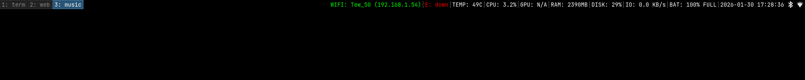

# my-i3-config

**minimalist i3wm config. zero bloat. pure vibes.**

i like my configs clean. i stripped out everything that doesn't matter. no dead code, no weird hacks, no clutter. just a readable config file that actually makes sense.

speed is the priority here. everything opens instantly. no animations, no lag, no waiting. you press a key, and it happens. simple as that.

## Preview ( •͡˘ _•͡˘)ノð





## keybindings reference

Since you probably don't want to read the entire `config` file, here is the quick cheat sheet. (Note: `$mod` is the **Super/Windows** key).

| Shortcut | Action |
| :--- | :--- |
| `$mod + Enter` | Open Terminal (`kitty`) |
| `$mod + d` | App Launcher (`rofi`) |
| `$mod + F2` | Web Browser (`qutebrowser`) |
| `$mod + F3 / Shift + p` | File Manager (`thunar`) |
| `Print` | Screenshot (`flameshot`) |
| `$mod + Shift + q` | Kill focused window |
| `$mod + f` | Toggle Fullscreen |
| `$mod + Shift + space` | Toggle Floating |
| `$mod + r` | Enter Resize Mode |
| `$mod + Shift + r` | Restart i3 |
| `$mod + Shift + e` | Exit i3 (with a warning) |
| `$mod + [0-9]` | Switch to Workspace |
| `$mod + Shift + [0-9]` | Move window to Workspace |

> **Navigation:** Use `$mod + j/k/l/;` for Vim-style focus or just use the arrow keys.

## disclaimer !!!
**READ THIS:**
This repo contains **ONLY** the `i3` config file. My `kitty`, `rofi`, and `picom` dotfiles are **NOT** included here. You have to configure those yourself to make them look good. You are on your own. Good luck.

## the stack (hard requirements)
If you don't install these, the config will probably crash and burn:
* **Window Manager:** `i3wm`
* **Terminal:** `kitty`
* **Launcher:** `rofi` (dmenu theme)
* **Browser:** `qutebrowser`
* **Others:** `picom`, `flameshot`, `brightnessctl`, `dex`, `nm-applet`, `blueman`

## how to steal this
1. Install the requirements listed above.
2. Yeet the `config` file into `~/.config/i3/`.
3. Press `$mod+Shift+r` to restart i3.

```bash
# Clone the repo
git clone [https://github.com/tiw302/my-i3-config](https://github.com/tiw302/my-i3-config)
cd my-i3-setup

# Copy config (Backup yours first!)
cp config ~/.config/i3/config
```

## install commands (for the lazy)
```bash
# arch
sudo pacman -S i3-wm kitty rofi qutebrowser thunar picom flameshot brightnessctl dex nm-applet blueman

# debian/ubuntu
sudo apt install i3 kitty rofi qutebrowser thunar picom flameshot brightnessctl dex network-manager-gnome blueman
```
